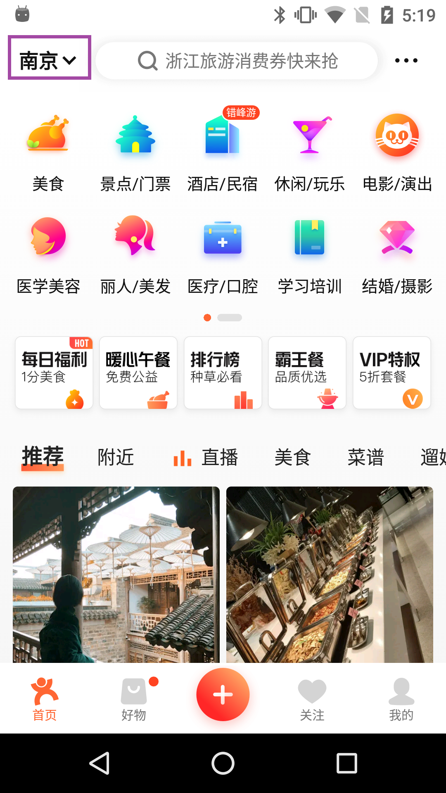
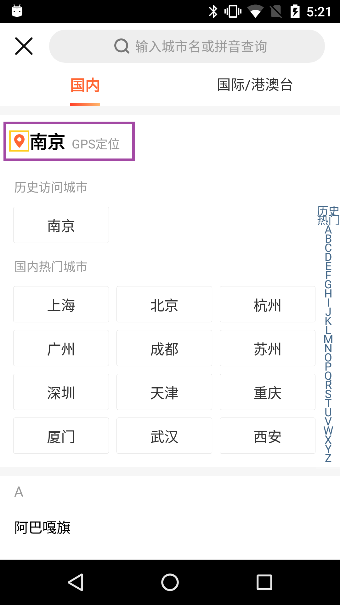
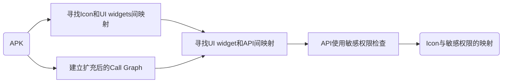
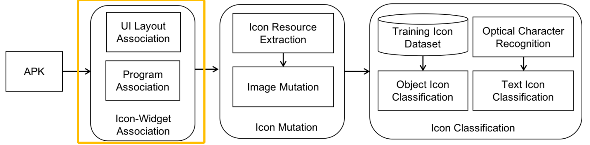
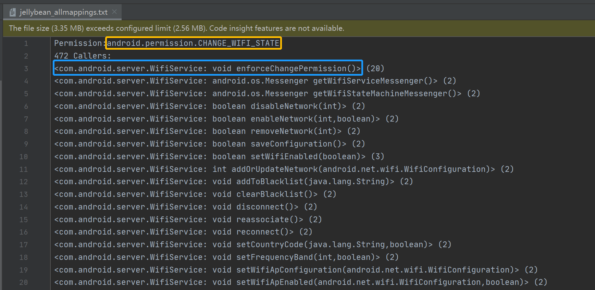

​        这学期学习使用了安卓静态分析工具([项目地址](https://github.com/deepintent-ccs/DeepIntent/tree/master/IconWidgetAnalysis))，本文将对这个工具的使用进行介绍和说明。

​        程序静态分析是指在不运行代码的方式下，通过词法分析、语法分析、控制流、数据流分析等技术对程序代码进行扫描，检查代码的规范性、安全性、可靠性、可维护等指标，安卓的静态分析就是分析软件的apk安装包，主要为了了解代码结构，逻辑的流程，修改、插入、去除逻辑、替换修改资源等。	

​        该安卓静态分析工具的目的是找出软件中和敏感权限使用相关的用户图形界面(GUI)中的图标图像和相关文本，得到软件中<icon,texts,permission>三元组，举个栗子，大众点评APP申请位置信息来给用户推荐附近的美食或者景点，下图是它的UI，点击右图框中的黄色图标就会调用Location这个敏感权限，那么工具的目标就是检测出这样的映射关系，并提取这个定位图标和UI中与定位图标相关的文本，形成<定位图标，[“南京”,“GPS定位”],Location>这样的三元组。另外，除了页面上图标和周围显示的文字，图标在程序中的名字也将被提取。

<center class="half">
    
    
</figure>


​        接下来是这个安卓静态分析工具的详细介绍和使用指南。

​        提取软件的<icon,texts,permission>三元组主要分为两个步骤：

### 1. 静态分析

​        在这一步骤中，这个工具使用了多个现有的程序静态分析工具（GATOR、IconIntent等）来建立GUI图标与它所对应的handler之间的映射，并进一步映射到敏感API和权敏感权限。该步骤的输入是软件的APK文件和软件的名单，输出是UI widgets和它们对应的UI handler、触发调用的敏感API和其对应的敏感权限，具体为一张表头为["APK", "Image", "WID", "WID Name", "Layout", "Handler", "Method", "Permissions"]的csv表格。

​        该工具通过寻找Icon与UI widget的映射，并通过建立经过扩充和改善的程序的Call Graph后，在UI widget对应的UI handler的call graph中寻找UI widget使用的API，并检查这些API是否使用了敏感权限，最终找出Icon和它所使用的敏感权限。

​        这一步骤主要分为四个小步：寻找Icon和UI widgets间的映射，建立扩充后的Call Graph、寻找UI widget和API间的映射、API使用敏感权限检查，流程图如下所示：



#### 	A. 寻找Icon和UI widgets间映射

​        这一小步是使用基于gator再开发的IconIntent来完成的。IconIntent是一份结合程序分析和Icon分类来识别安卓软件中敏感UI widgets使用的工作，它的原型工具的结构如下图，在这里我们主要使用黄框圈出的Icon-Widget Association模块。



​        在介绍IconIntent如何寻找Icon和UI widget间的映射之前，我们先明确一下Icon、UI widget、Layout等概念，下面是一个调用Location权限的天气APP的UI layout文件（search.xml）、渲染之后的UI界面以及该APP中对应界面的UI handler程序代码。

**Layout**一种树状的页面布局，决定了UI页面中有什么元素以及元素用怎样的方式组织展示，它可以从Layout的xml文件中获取，下面的search.xml布局中就拥有4个元素，一个LinearLayout、一个ImageView、一个EditText、和一个Button，其中LinearLayout元素是其它三个元素的父亲。一个Layout可被Layout ID唯一标识，如程序代码段第3行中的R.layout.search。

**UI widget**：在Layout布局中，UI widget是指像页面中的button这样能与用户产生交互行为的元素，在search.xml布局中，除了LinearLayout元素，其它三个元素都为UI widget，且可以通过<Layout ID, element ID>对来唯一标识。

**Icon**是一种资源，可被resourse ID唯一标识。如下面的search.xml中的第2行中的@drawable/loc，它就直接指向资源文件夹中的文件，即res/drawable/loc.png图片。

```xml
<LinearLayout android:orientation="horizontal">
	<ImageView android:id="@+id/img" android:src="@drawable/loc" .../>
	<EditText android:id="@+id/TxtCity" ... />
	<Button android:text="@string/search" .../>
</LinearLayout>
```

<center style="font-size:14px;color:#C0C0C0;text-decoration:underline">Layout文件   search.xml</center>


<center style="font-size:14px;color:#C0C0C0;text-decoration:underline">渲染后的页面</center>


```java
public class SearchForm extends Activity {
	public void onCreate(Bundle savedInstanceState) {
		setContentView(R.layout.search); // bound to layoutfile search.xml 
		((ImageView) findViewById(R.id.img)).setOnClickListener(new OnClickListener() 			{
			public void onClick(View v) {startAsincSearch();} });
		... } // bound to OnClick handler
    private void startAsincSearch() {
    	...
    	ManagerOfLocation.findPosition(); // use GPS data
        ... }}
```

​        在安卓软件中，Icon可以通过在UI Layout文件或源代码中指定来与UI widgets绑定。每个Layout、UI widget、Icon都有自己的唯一标识ID。Layout文件在既可以在Activity一开始调用setContentView() API时被加载，就像程序段第3行的设置，或者是在Activity运行过程中调用inflate() API来加载，在这之后Layout中的UI widgets就可以通过findViewByID()等API来调用，如程序段第4行的操作。

​        Icon可以直接与Layout文件中的UI widgets来绑定，如search.xml第2行，此时通过android:src属性，我们将Icon loc绑定到了ImageView这个UI widget上。除了android src，Icon也可以通过其他属性来与UI Widget绑定，但是经过调查，Icon绑定的widgets一般都是用来与用户交互的，而用其它属性（如android background）绑定的Icon往往是用来美化界面的，通常不带有敏感权限使用的意图，所以该工具主要专注于通过android src绑定的Icon。除了资源的名字，android src也明确了一些drawable objects，drawable objects常见于复选框和单选按钮，用来根据UI widgets的状态来显示不同的图片。比如下图的资源XML文件就明确了当UI widget被选中时显示第一个Icon，不然就显示第二个。

```xml
<selector>
	<item android:state_checked="true" android:drawable="
		@drawable/btn_radio_to_on_mtrl_015" />
	<item android:drawable="@drawable/
		btn_radio_to_on_mtrl_000" />
</selector>
```

<center style="font-size:14px;color:#C0C0C0;text-decoration:underline">资源XML文件</center>

​        针对直接和Layout文件中的UI widgets绑定的Icon，工具使用XML parser来解析从APK文件提取出来的Layout文件形成UI Layout，并且检查所有Layout中的UI  widgets是否被Icon绑定。在search.xml中，从Layout树的树根LinearLayout出发遍历UI Layout树，就可以检测到id为@id/img的ImageView widget被资源名为@drawable/loc的Icon绑定了。接下来判断Icon的资源名是直接指向资源文件（如res/drawable/loc.png文件）还是表示着drawable object的资源XML文件，如果指向的是资源XML文件，那么继续解析资源XML文件，遍历XML的元素通过android:drawable属性来提取每一个的Icon的资源名。

​        除了在Layout文件中被绑定，UI widgets可能会在特定事件发生时使用不同的Icon，这个可以通过调用setImageResource() API来实现，比如下面的代码段第2和3行将ImageView widget赋值给了变量g和h，第4行让变量h使用了R.drawable.icon2这个Icon，此时Icon R.drawable.icon2就绑定到了UI widget ImageView上。

```java
void onCreate(Bundle savedInstance) {
	View g = this.findViewById(R.id.button_esc); // FindView
	ImageView h=(ImageView) g; // cast to ImageView
	h.setImageResource(R.drawable.icon2); // change icon
	... }
```

​        针对通过程序代码中使用API调用来绑定的情况，IconIntent进行了一个overapproximate的数据流分析，通过分析程序调用findViewById()和setID()等API时程序变量和UI widget的绑定和调用fsetImageResource()时程序变量和Icon的绑定来推断数据流向和Icon与UI widget的绑定。具体来说，我们用 $\Gamma(x) $表示与变量绑定的UI widgets，用$\Sigma(x) $表示与变量x绑定的Icon，则$ \{w_t \rightarrow i_t|w_t \in \Gamma(x_t), i_t \in \Sigma(x_t) \} $ 就表示Icon与UI widgets的多对多绑定，以刚才的程序举例，第2行我们有$\Gamma(g) = \{R. id.button_{esc}\}$，第3行有$\Gamma(h) = \{R. id.button_{esc}\}$，第4行有$\Sigma(g) = \{R.drawable.icon2\} $和$\Sigma(h) = \{R.drawable.icon2\} $，最后我们就有了$\{R.id.button_{esc} \rightarrow \{R.drawable.icon2\}\} $的Icon与UIwidget的映射。

#### 	B.建立扩充后的Call Graph

​        要想找到Icon和Permissio间的映射关系，我们需要借助于程序的call graph。安卓程序是由事件驱动的，用户打开软件在其中浏览的时候，安卓框架会启动一系列lifecycle事件，并调用一些像onCreate和onResume这样的lifecycle相关的方法，用户和界面上的UI进行交互时，也会触发一系列UI交互事件，并调用像onClick这样的callback方法。多线程通信也会将程序的执行剥离开来，在前端和后台一起执行。为了辨认哪些行为被触发（比如调用某个API、某个敏感权限被使用），工具将为每一个UI handler建立静态call graph。

​        下面是一个通过多线程来使用GPS location信息的例子，第5行当UI widget ImageViewLocation被点击的时候，startAsincSearch方法将被调用，然后第十行，新线程被初始化并开始运行，随后就将在第17行调用一个请求GPS信息的敏感API。在这个例子中我们可以看到，调用关系除了显性地存在于函数调用语句，也隐式地存在于setOnClickListener和onClick间、searchThread.start和LocationThread.run之间。

```java
public class SearchForm extends Activity {
    public void onCreate(Bundle savedInstanceState) {
        setContentView(R.layout.search); 
        ((ImageView)findViewById(R.id.ImageViewLocation)).
        setOnClickListener(newOnClickListener {
            public void onClick(View v) {startAsincSearch;} });
     ... } // bound to OnClick handler
	private void startAsincSearch {
        ...
        searchThread = new LocationThread;
        searchThread.start; // bound to LocationThread.run
	... } } // end of class SearchForm

class LocationThread extends Thread {
	...
	public void run {
		ManagerOfLocation.findPosition; // use GPS data
	... } }
```

​        除此之外，通过安卓中的Inter-Component Communication(ICC)的service或者broadcast receiver也能调用敏感API。安卓中有四大component：

* Activity：代表着用户界面，担任与用户交互的任务。
* Service：用来完成不用界面就能完成的后台任务，比如预读取文件、持续播放背景音乐。
* Content Provider：用来管理共享的结构化文件。
* Broadcast Receiver：用来过滤和接收消息。

​        组件间主要通过统一资源标识符URI和Intent来进行通信，其中，URI用来在Content Provider中定位数据。Intent由当前源component发出，它的目标component可以显式地通过命名来确定，像下面的第5行，显式地确定了该Intent的目标component是包a.b中的a.b.MyClass；也可以隐式地由Intent的字段来决定，就像else分支里确定了该Intent的action和data字段，用于后面的目标component寻找。

```java
public void onClick(View v) {
	Intent i = new Intent();
	if ( this.mCondition) {
		i.setClassName("a.b","a.b.MyClass");
        i.putExtra("Balance", this.mBalance);
	} else {
        i.setAction("VIEW");
		Uri geoUri = Uri.parse("geo:" + latitude + "," + longitude );
		i.setData(geoUri);
	}
	startActivity(i); }
```

​        Intent中的字段携带着很多信息，action字段代表了目标component将要执行的操作，categories字段添加系统可以使用的component信息，data字段包括了目标component需要操作的数据，以URI的形式存在。而目标component可以通过声明Intent Filter来接收隐式Intent，Intent Filter大部分定义在mainfest文件中，也有在程序中动态的Broadcast Receiver中声明，下面这个声明在mainfest文件中的MapRenderingActivity中的Intent Filter，它接收data字段为VIEW、data字段为geo的Intent，刚好能与Intent i完美匹配，那么MapRenderingActivity就是Intent i的目标component，那么在上面代码片中的startActivity(i)和MapRenderingActivity间也存在着调用关系。在静态分析中，如果不考虑ICC中的隐式调用，那call graph将会缺失很多信息；如果没有仔细地分析ICC中每一个Intent中的字段，那么为了保险，将Intent和每一个可能收到的Intent Filter都一一加边，这样会产生很多false positives，使call graph稠密且不精确。

```xml
<activity android:name="MapRenderingActivity"> 
	<intent-filter>
		<action android:name="VIEW"/>
		<data android:scheme="geo"/>
		<category android:name="DEFAULT"/>
	</intent-filter >
</activity >
```

​        所以仅仅依靠于由显式的调用语句构造的call graph是不够的，我们还需要加一些隐形的边。为了准确地寻找出每个UI handler都触发了哪些API，工具在显式的call graph上再添加一些适量的、恰当的隐式的边，这样既捕捉到了隐式的调用关系，又不会给每一种可能的lifecycle方法间的、多线程中的、ICC中的组合调用关系来穷尽加边而造成很多false positive。工具主要在显式的call graph上加四种较为常见的边：多线程中的、lifecycle方法间的、事件驱动方法间的和ICC中的。前三种加的边如下表所示：

|       Caller       |                       Callee                        |
| :----------------: | :-------------------------------------------------: |
| setOnClickListener |                       onClick                       |
|    Thread.start    |                     Thread.run                      |
| AsyncTask.execute  | doInBackground<br> onPreExecute<br> onPostExecuteon |
|    sendMessage     |                    handleMessage                    |

​        工具使用IC3（[项目地址](https://github.com/siis/ic3)）来分析ICC过程，它努力准确推测ICC数据传递过程中复合变量值(Intent)，并在这基础上给Intent和它可能的目标component做匹配，大大减少component间通信的错误推断（即false positives）数量。IC3将复合变量(Intent)的传递问题用申诉式语言COAL规范来表示，并通过将COAL规范转换为具有distributive性质的环境转变者(environment transformer)将复合变量的传递问题规约为Interprocedural Distributive Environment(IDE)问题，并利用现有的方法有效求解。IC3中的复合变量Intent和URI中的字段值推测是将Intent作为整体来求解，而不是同其它方法一样对Intent中的字段组合求解，避免了可能的答案数量的爆炸。

#### 	C.寻找UI widget和API间的映射

​        在完成程序的call graph构建后，需要寻找UI widgets和UI handler之间的关联，并为UI handler构建相应的call graph子图。这一步工具使用的是安卓静态分析工具gator，它通过一个overapproximate的数据流分析来绑定UI widgets和UI handler，此时再结合第一步中Icon和UI widgets的关联，就可以得到Icon、Layout文件、UI widgets和UI handler间的映射关系。在第一步的例子中，UI widget img就和Layout文件search.xml绑定，在Layout文件中可看出UI widget img和Icon loc绑定，在代码片段中推测出UI widget img和UI handler SearchForm.onClick() 绑定。在得到完整的映射关系后，工具为每一个UI handler构造属于它的call graph，这个call graph是第二步得到的整个程序扩充后的call graph的子图，是包含了该UI handler在完整call graph中能到达的点和边的子图，工具遍历这子图，就能得到该UI handler调用了哪些API，得到UI widget和API间的映射。

#### 	D.API使用敏感权限检查

​        在找到每个Icon将使用哪些API后，我们需要找出这些API分别使用了哪些敏感权限，从而形成Icon到敏感权限的映射，在这一步中，工具借助了Pscout来寻找API和敏感权限的对应关系。Pscout通过对安卓源代码的静态分析找到了17k多个API与权限的对应关系，并且由于Pscout的设计和实现是与安卓版本无关的，所以随着安卓版本的更新，新版本的API与权限对应关系可以重新获得。工具使用用的是jellybean版本的对应关系。值得注意的是，由于一个UI widget可能有多个UI handler，一个UI widget也可能触发多个敏感API，一个敏感API可能也对应着多种权限，所以在最后的中，一个Icon可能对应着多个敏感API。

### 2. Context文本提取

​        相似的图标在不同的程序上下文中可能会有不同的含义，这里的程序上下文主要是指UI信息，工具搜集UI中Icon附近或相关的文本来作为补充的程序上下文信息。这一步骤的输入是静态分析步骤的输出：包括了Icon、UI widget、Layout文件、UI handler、敏感API和敏感权限映射关系的csv文件和解码后的apk文件，输出即为<icon,texts,permission>三元组。

​        在静态分析步骤中，我们得到了UI widget对应的Layout文件和Icon图标，在这基础上，工具提取了3种程序上下文文本：Layout文件中的展示文本、Icon图片中内嵌的文本和按命名规则拆分的资源名称文本。在提取Layout文件中的文本时，工具可选择提取整个Layout文件中的文字或者只提取祖先节点中的文本；工具使用OCR来获取Icon图片中内嵌的文本；在获取资源名称文本时，工具按照驼峰命名法或者下划线命名法来对Icon的名字进行分割，得到更准确与丰富的文本。

​        另外，工具还增加了翻译元，可以将其他语言翻译成英语，提高了工具的泛化能力。

​        对于该工具的介绍到这里了，最后附上静态分析步骤的完整使用脚本runImg2widgets.sh( [脚本链接](https://github.com/gungunyuanda/DeepIntent-Script/blob/main/runImg2widgets.sh))。

使用Tips: 

1. **该工具暂时只支持Mac OS和Linux**，不必在Windows上浪费时光。

2. 能顺利运行脚本的终极奥义就是填对脚本中的文件路径和代码中的文件路径，其中在/Static_Analysis/APKCallGraph/src/APKCallGraph.java代码中需要修改的文件路径有第270、285、501、 503、632行。

3. 在使用ic3工具时脚本中缺少了将Method和它们使用的Permission的对应关系导入数据库的一步，所以需要自行导入，数据来源为项目中的jellybean_allmappings.txt文件，它的截图如下：其中黄框中的是Permission，蓝框中的是Method。

   

   另外，还需要需要修改/Static_Analysis/ic3/cc.properties和/Static_Analysis/APKCallGraph/src/APKCallGraph.java第674、675行的数据库配置，且需要将第675行的database的名称从"APKCalls"改为"cc"。

参考文献

[1] Xi S, Yang S, Xiao X, et al. DeepIntent: Deep icon-behavior learning for detecting intention-behavior discrepancy in mobile apps[C]//Proceedings of the 2019 ACM SIGSAC Conference on Computer and Communications Security. 2019: 2421-2436.

[2] Xiao X, Wang X, Cao Z, et al. Iconintent: automatic identification of sensitive ui widgets based on icon classification for android apps[C]//2019 IEEE/ACM 41st International Conference on Software Engineering (ICSE). IEEE, 2019: 257-268.

[3] Octeau D, Luchaup D, Dering M, et al. Composite constant propagation: Application to android inter-component communication analysis[C]//2015 IEEE/ACM 37th IEEE International Conference on Software Engineering. IEEE, 2015, 1: 77-88.

[4] Octeau D, McDaniel P, Jha S, et al. Effective inter-component communication mapping in android: An essential step towards holistic security analysis[C]//22nd {USENIX} Security Symposium ({USENIX} Security 13). 2013: 543-558.

[5] Arzt S, Rasthofer S, Fritz C, et al. Flowdroid: Precise context, flow, field, object-sensitive and lifecycle-aware taint analysis for android apps[J]. Acm Sigplan Notices, 2014, 49(6): 259-269.

[6] Au K W Y, Zhou Y F, Huang Z, et al. Pscout: analyzing the android permission specification[C]//Proceedings of the 2012 ACM conference on Computer and communications security. 2012: 217-228.


 

